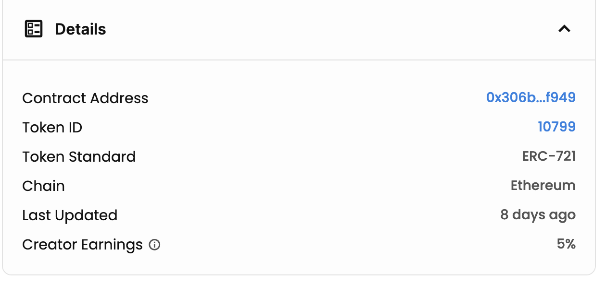

# File Data Sources Workshop 2023

### [Workshop Slides](https://docs.google.com/presentation/d/11CKH20u1VC1SAAAyJY2uvaXnBFbDqlwEcBfhI3KbtKY/edit?usp=sharing)

[](https://docs.google.com/presentation/d/11CKH20u1VC1SAAAyJY2uvaXnBFbDqlwEcBfhI3KbtKY/edit?usp=sharing)

-   This repo has a fully functional subgraph that implements File Data Sources and Full Text Search.
-   For this workshop, I used this [address](https://etherscan.io/address/0x306b1ea3ecdf94ab739f1910bbda052ed4a9f949) and this [metadata](https://ipfs.io/ipfs/QmdYeDpkVZedk1mkGodjNmF35UNxwafhFLVvsHrWgJoz6A/beanz_metadata/0) from the [Beanz NFT collection](https://opensea.io/collection/beanzofficial).
-   Clone and deploy this repo's subgraph to start tinkering with File Data Sources.

## Prerequisites

-   Install graph-cli: `yarn global add @graphprotocol/graph-cli`

## Option 1: Deploy This Repo's Premade File Data Sources Subgraph

-   Create a subgraph through [Subgraph Studio](www.thegraph.com/studio) but do not deploy it just yet. Instead of deploying a boilerplate subgraph, you'll be deploying this repo's subgraph to your newly created Subgraph Studio dashboard.

-   Clone this repo, then `yarn install`.
-   Copy/paste the Authentication Key from Subgraph Studio into your terminal and authenticate your computer.
-   `cd <yourSubgraphFolder>` from this repo and copy/paste the `graph deploy --studio <nameOfYourSubgraph>` from Subgraph Studio into your terminal to deploy this repo's subgraph.
-   Wait 20-30 min for the subgraph to index IPFS. Once indexed, you will not have to wait this long again. 
-   Begin querying our File Data Sources subgraph!
-   This repo's subgraph has [Full Text Search](https://thegraph.com/docs/en/developing/creating-a-subgraph/#defining-fulltext-search-fields) feature integrated as its quite useful when querying NFT Metadata.

## Option 2: Deploy a File Data Sources Endabled Subgraph That Indexes A Different NFT

Use a NFT marketplace like Opensea to find an NFT and gather its contract address and open its link to its IPFS metadata.

You can find this data on each NFT on Opensea by navigating to a specific NFT, clicking on its `details` -> `contract address` and `token ID`.

[](https://opensea.io/assets/ethereum/0x306b1ea3ecdf94ab739f1910bbda052ed4a9f949/0)

Use [Miniscan](https://miniscan.xyz/) to find important information relevant to your subgraph (smart contract name, ABI, startblock).

#### 2. Go to [Subgraph Studio](https://thegraph.com/studio/), and build a new subgraph

-   Follow the instructions in Subgraph Studio to spin up a new subgraph on your local computer using `graph-cli`.

-   Enter information gathered from MiniScan about your smart contract into `graph-cli` as prompted.

-   Choose "yes" when asked if wanting to index events as entites.
-   `graph deploy`... to deploy your subgraph

#### Review and update key files in your scaffolded subgraph:

-   subgraph.yaml (Subgraph Manifest)
-   src/mappings.ts (Subgraph Logic)
-   schema.graphql (Presented Subgraph Data)
-   Refer to documentation and the subgraph in this repo for specific changes and techniques.

## Option 3: Build With Data Edge Contracts

-   Read [The Graph Unlocks a New Web3 Use Case: Organizing Off-chain Data](https://thegraph.com/blog/the-graph-off-chain-data-web3-data-pipelines/) by Craig Tutterow
-   Learn about the [Data Edge GIP](https://forum.thegraph.com/t/gip-0025-dataedge/3161)
-   Send the Data Edge smart contract the Qm hash and any other metadata you'd like formatted properly, and it will emit that message as an event. Useful for getting the chain to trigger a IPFS file search for a specific hash that was passed to the smart contract.

```solidity
// SPDX-License-Identifier: GPL-2.0-or-later

pragma solidity ^0.8.12;

/// @title Data Edge contract is only used to store on-chain data, it does not
///        perform execution. On-chain client services can read the data
///        and decode the payload for different purposes.
///        NOTE: This version emits an event with the calldata.
contract EventfulDataEdge {
    event Log(bytes data);

    /// @dev Fallback function, accepts any payload
    fallback() external payable {
        emit Log(msg.data);
    }
}
```

## Official File Data Sources Documentation

-   https://thegraph.com/docs/en/developing/creating-a-subgraph/#file-data-sources

## Other good subgraphs:

-   [Cryptocoven File Data Sources (and older ipfs.cat) Subgraph](https://github.com/azf20/cryptocoven-api/tree/file-data-sources-refactor)
-   [Messari Subgraphs](https://subgraphs.messari.io)
-   [EIP-721 (NFTS on The Graph Network)](https://thegraph.com/explorer/subgraph?id=AVZ1dGwmRGKsbDAbwvxNmXzeEkD48voB3LfGqj5w7FUS&view=Overview)
-   [Lens Protocol](https://thegraph.com/hosted-service/subgraph/anudit/lens-protocol)
-   [Unlock Protocol on The Graph Network](https://thegraph.com/explorer/subgraph?id=8u7KcVRxjtTDRgEJup3UuPJk6YoRDTHNpSMk5BEpdw42&view=Overview)
-   [Open Sea Subgraph](https://thegraph.com/hosted-service/subgraph/protofire/opensea-wyvern-exchange-subgraph)
-   [LiNEAR](https://thegraph.com/hosted-service/subgraph/linear-protocol/linear)
-   [Aave Gotchi](https://thegraph.com/hosted-service/subgraph/aavegotchi/aavegotchi-core-matic)
-   [Tellor](https://thegraph.com/hosted-service/subgraph/tellor-io/tellorxoraclemainhgraph)
-   [Live Peer](https://thegraph.com/hosted-service/subgraph/livepeer/arbitrum-one)
-   [ENS](https://thegraph.com/hosted-service/subgraph/ensdomains/ens)
-   [UMA on The Graph Network](https://thegraph.com/explorer/subgraph?id=41LCrgtCNBQyDiVVyZEuPxbvkBH9BxxLU3nEZst77V8o&view=Overview)

#### Other resources

-   https://github.com/schmidsi/hackathon-starterkit
-   https://github.com/scaffold-eth/scaffold-eth#-scaffold-eth
-   https://github.com/Developer-DAO/resources
-   https://dev.to/dabit3/the-complete-guide-to-full-stack-ethereum-development-3j13
-   https://github.com/itsjerryokolo/CryptoPunks
-   https://github.com/dabit3/building-a-subgraph-workshop
-   https://thegraph.com/docs/developer/quick-start
-   https://thegraph.com/discord
-   https://protean-labs.github.io/subgrounds/

```

```
